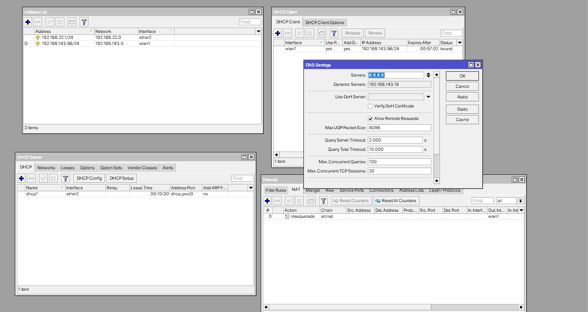
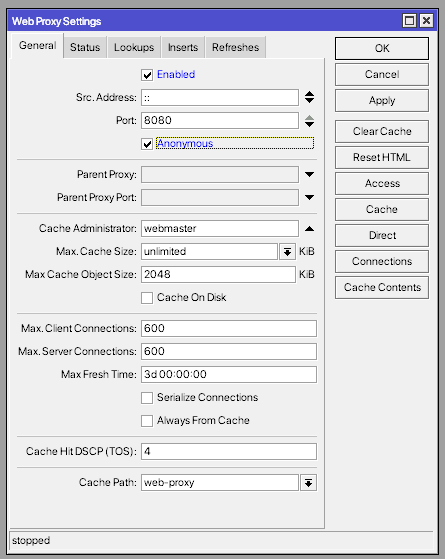
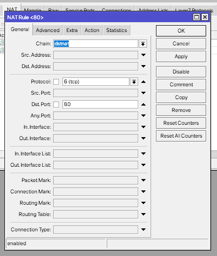
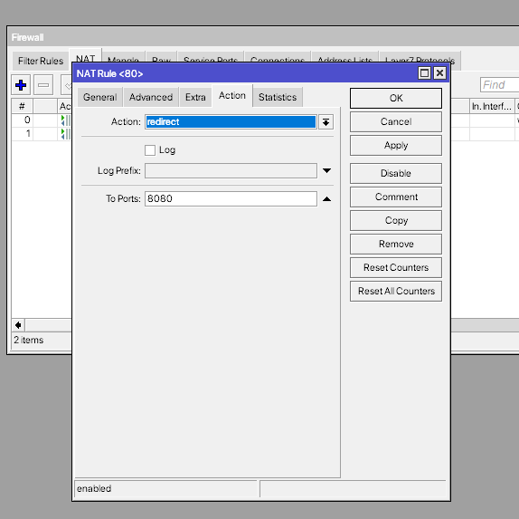
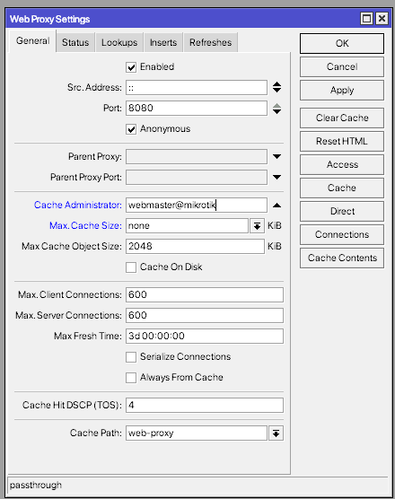
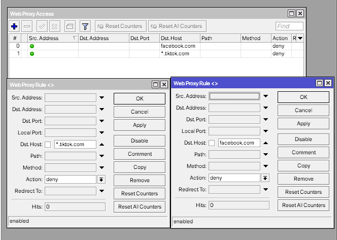

# LAB-35-Web-Proxy
Rabu 20 Agustus 2025
  
# Web Proxy  
  Secara sederhana, proxy bisa diartikan sebagai server atau program yang bertugas mewakili komputer lain saat meminta konten dari internet maupun intranet. Jadi, bisa dibilang proxy ini semacam perantara sekaligus pelindung ketika kita mengakses jaringan internet. Jenis proxy sendiri ada cukup banyak, misalnya SSL Proxy, Web Proxy, Intercepting Proxy, Reverse Proxy, dan lain-lain. Setiap jenis punya fungsi masing-masing sesuai kebutuhan. Nah, kali ini kita akan bahas salah satu proxy yang sudah tersedia sebagai fitur bawaan di RouterOS MikroTik, yaitu Web Proxy.  

# Konfigurasi Web Proxy
  1. Lakukan konfigurasi dasar sampai router dan client bisa terhubung ke internet.  
    
  2. Langkah berikutnya adalah mengaktifkan fitur proxy bawaan RouterOS. Secara default, fitur ini dalam keadaan nonaktif. Untuk mengaktifkannya bisa pergi ke **IP > WEB PROXY**  
    
  3. Supaya lebih praktis, administrator biasanya mengkonfigurasi transparent proxy. Dengan metode ini, client tidak perlu lagi mengubah pengaturan di browser.  
  
    
  5. Salah satu keunggulan Web Proxy adalah kemampuannya menyimpan (cache) file yang sering diakses, sehingga akses berikutnya akan lebih cepat. Untuk mengatur cache:  
    
  6. Selain caching, proxy juga sering dipakai untuk membatasi akses ke situs tertentu. Misalnya, jika ingin memblokir akses ke Facebook dan TikTok, di **ip > web proxy > access**.  
    
  
# Kesimpulan
  Web Proxy pada MikroTik adalah fitur penting yang dapat dimanfaatkan untuk caching data, menghemat bandwidth, serta melakukan filtering situs berbasis HTTP. Namun, perlu dicatat bahwa proxy MikroTik hanya bekerja pada protokol HTTP (port 80), sementara HTTPS tidak bisa diproses langsung tanpa SSL interception.  

# Sumber
https://www.youtube.com/watch?v=InuSUDw-_dY  
https://citraweb.com/artikel/123/  
https://blog.dnetprovider.id/2018/11/02/tutorial-mikrotik-membuat-web-proxy-pada-mikrotik/  
